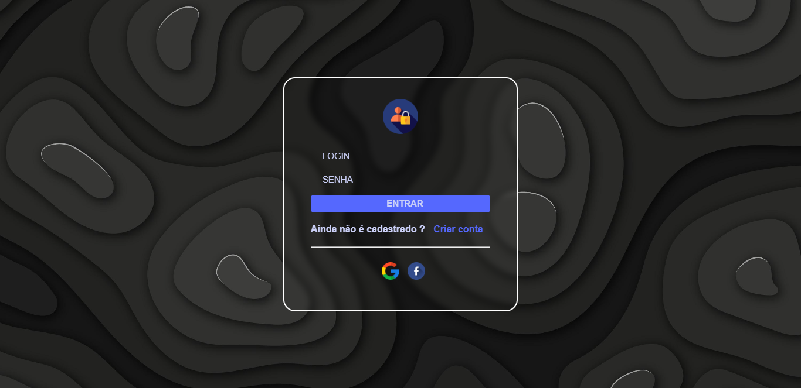
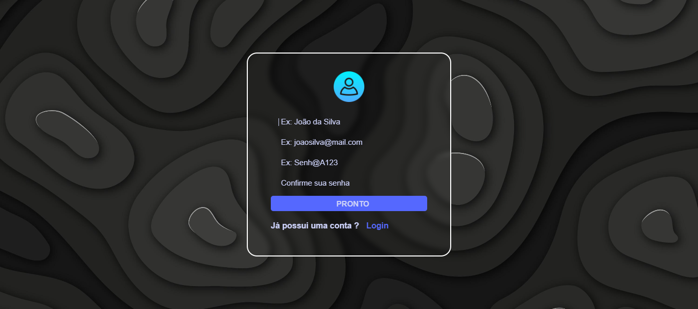

<h1> Tela de Login e cadastro de usuário</h1>

Tela de login e cadastro de usuario com visual minimalista

 

<h2>Tecnologias usadas</h2>
    <ul>
        <li>HTML</li>
        <li>CSS</li>
        <li>
Efeito Glassmorphism (vidro embaçado) feito aepenas com CSS
</li>
    </ul>

Preview tela de login com a alternativa de login social

Preview tela de cadastro de usuario

