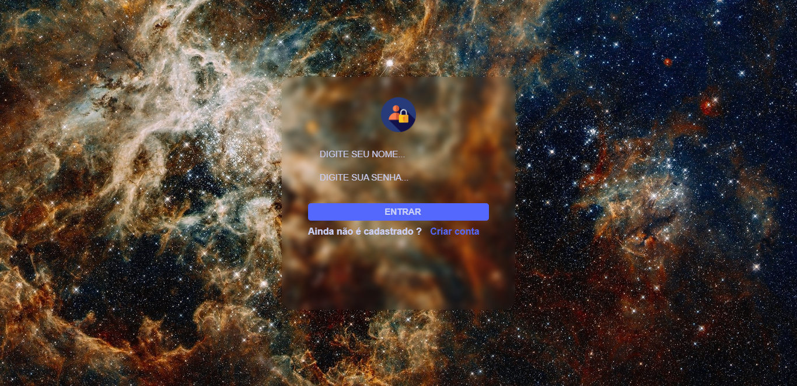
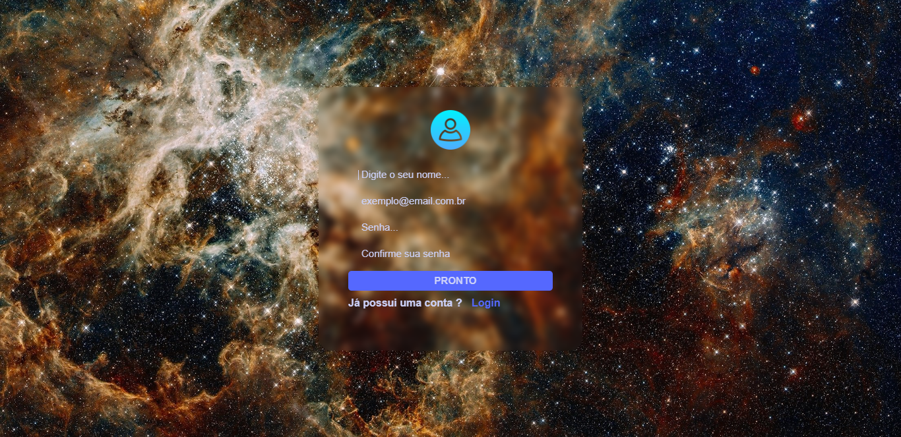

# tela-login
<h1> Tela de Login e Cadastro de usuário</h1>
 
Tela de login e cadastro de usuario utilizando apenas HTML, CSS

 
Efeito de Glassforism (vidro embaçado) feito apenas com CSS

Preview tela de login

Preview tela de cadastro de usuario
